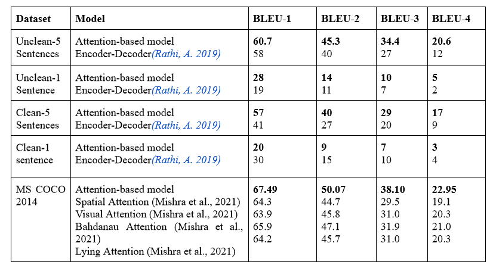

# ICS_hindi

Image captioning service in Hindi.

check the webapp https://ics-hindi.herokuapp.com/. [Currently not working due to Git LFS quota exceeded issue]

For more details check the wiki pages.

## Kaggel Code 

You can check complete code used to build the model used in this website on following kaggle notebook [https://www.kaggle.com/code/dsmeena/image-captioning-with-flickr8k-hindi-using-pytorch/notebook].

## Data processing

### Image processing
We have used the pretrained Inceptionv3 model for feature extraction from image, it is developed by google (Szegedy et al. 2015). We have saved all the feature maps.

### Text processing

This involves three steps:

1. Wraps tags around the captions to know the starting and ending of a caption.
2. Tokenization is done to tokenize the words and using these tokens we create a vocabulary.
3. Numericalization is applied to all captions with the help of vocabulary to convert the captions into a sequence of integers.

### Model

We have used an attention based encoder-decoder model. Our methodology has three components: encoder model, decoder model and attention model. 
1. Encoder model do the encoding of the images; it uses a pretrained CNN model to extract the features of the images.   
Before training, we encode text descriptions by building a vocabulary class that contains all words mapped to an index.
2. Decoder model generates captions using the image feature and attention weights generated by the attention model.
3. Attention model generates the attention weights using the encoded image and previous hidden state value from the decoder.

 

Attention based model

## Directory 

static folder has the main code to process the inputs and generate output.

- image_processing.py: This has the code related to image processing.
- text_pre_processing.py: This has the code related to text processing.
- model_implementation.py: This contains the encoder-decoder logic of model and also the attention mechanism.

## Results

## Current Issue

Currently the deployment is failing due to Git LFS quota issues on this repository.

The Heroku build logs are as follows: 
    
    Git LFS initialized.
    batch response: This repository is over its data quota. Account responsible for LFS bandwidth should purchase more data packs to restore access.
    error: failed to fetch some objects from 'https://xxxx@github.com/28-08-2000/Image-captioning-service-in-Hindi.git/info/lfs'
    !     Push rejected, failed to compile Git LFS app.
    !     Push failed
